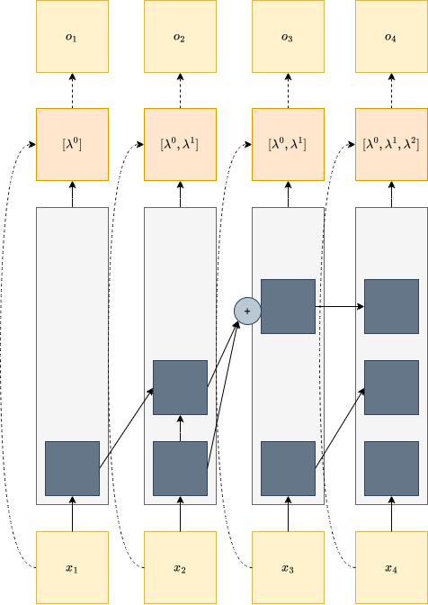

# MLP-Parameterized Lambda in Log-Linear Attention



Forked from [HanGuo97/log-linear-attention](https://github.com/HanGuo97/log-linear-attention) (ICLR 2026).

We replace the static linear λ projection in Log-Linear Attention with a small two-layer MLP, enabling input-dependent memory weighting across Fenwick-tree levels. This improves associative recall under high complexity and length generalization.

| Model | kv=32 accuracy | Length gen. (128→256) | Wikitext-103 PPL |
|---|---|---|---|
| Fixed λ (baseline) | 60.9 ± 46.7 | 3.3% | coming soon |
| **MLP Softplus λ (ours)** | **99.6 ± 0.1** | **33.2%** | coming soon |

# Language modeling experiments (Wikitext-103) are in progress.

Our contribution lives in `hattention/lambda_mlp.py` (`LambdaMLPSoftplus`, `LambdaMLPSoftmax`).

## Setup

1. Clone the repository and its submodules:

```
git clone --recursive https://github.com/YaxitaAmin/log-linear-attention-lamda-MLP.git
cd log-linear-attention-lamda-MLP
```

2. Install the package and its dependencies:

```
pip install -e .
pip install -e flame/
pip install -r flame/3rdparty/torchtitan/requirements.txt
```

### Docker Installation (Optional)

We provide a `Dockerfile` for containerized setup. To use it:

```
# Build the Docker image
DOCKER_BUILDKIT=1 docker build \
    -t log-linear-attention \
    -f Dockerfile \
    .

# Run the container
docker run -ti \
    --gpus all \
    log-linear-attention \
    bash
```

## Data Preparation

1. Configure the data preprocessing:
   * Open `hattention/preprocess_data.py`
   * Modify the save path to your desired location
2. Run the preprocessing script:

```
python -m hattentions.preprocess_data
```

> **Note:** The data preprocessing step may take a while.

## Training

1. Navigate to the training framework:

```
cd flame/
```

2. Launch training with the following command:

```
bash ../scripts/train_flame.sh --name [NAME] --config [CONFIG] --seed [--ac]
```

* `NAME`: Name for the experiment and save path
* `CONFIG`: Name of the config file in `configs/flame/` (without .json extension)
* `--seed`: Create a seed checkpoint before training
* `--ac`: Optional flag to enable activation checkpointing

> **Note:**
> 1. Before training, modify the absolute file paths in `scripts/train_flame.sh` to match your setup
> 2. The first training step will compile Triton kernels, which may take tens of minutes

## Acknowledgement

This work was conducted as part of MSML612 at the University of Maryland, College Park by Yaxita Amin, Helen Li, and Mengfan Zhang.
